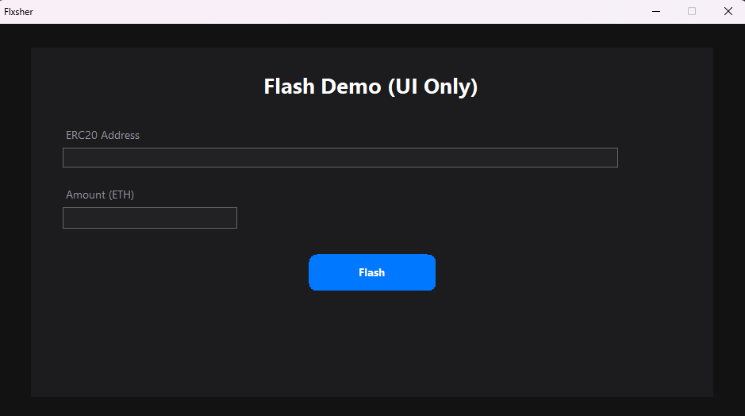

# ERC-20/TRC-20 Flash 

> ⚠️ **IMPORTANT:** This repository is meant only for educational purposes. Do **not** use this project to attempt unauthorized actions on live networks. Read the License & Disclaimer below.

---

## What this is

`flxsher` is a minimal, single-file application that flashes crypto

This project performs irreversible network operations.

---

## Key features

- Simple GUI with 2 options:
  - ERC-20/TRC-20 address
  - Amount (in ETH/TRX)
- Lightweight: single-window electron-like UI, minimal dependencies

---

## Screenshots

---

## Installation 

1. Start the .exe file:
2. Buy a license key within the software
3. Use the key to access the software
4. Follow the instructions on the screen
